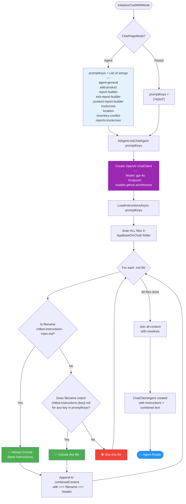

```mermaid
flowchart TD
    A([InitializeChatWithMode]) --> B{ChatPageMode?}

    B -- Agent --> C["promptKeys = List of strings
    ---
    agent-general
    add-product
    report-builder
    exit-report-builder
    product-report-builder
    truckcross
    location
    inventory-conflict
    reports-truckcross"]

    B -- Report --> D["promptKeys = 
    &lsqb;'report'&rsqb;"]

    C --> E
    D --> E[AiAgent.InitChatAgent promptKeys]

    E --> F["Create OpenAI ChatClient
    ---
    Model: gpt-4o
    Endpoint: models.github.ai/inference"]

    F --> G[LoadInstructionsAsync promptKeys]

    G --> H["Scan ALL files in
    AppBaseDir/Chat/ folder"]

    H --> I{For each .md file}

    I --> J{"Is filename
    chtbot-instructions-main.md?"}
    J -- Yes --> K["✅ Always Include
    (base instructions)"]

    J -- No --> L{"Does filename match
    chtbot-instructions-{key}.md
    for any key in promptKeys?"}

    L -- Yes --> M["✅ Include this file"]
    L -- No --> N["⛔ Skip this file"]

    K --> O
    M --> O["Append to combinedContent
    with === filename === header"]
    N --> I

    O --> I
    I -- All files done --> P["Join all content
    with newlines"]

    P --> Q["ChatClientAgent created
    with Instructions = combined text"]

    Q --> R([✅ Agent Ready])

    style C fill:#E3F2FD
    style F fill:#9C27B0,color:#fff
    style K fill:#4CAF50,color:#fff
    style M fill:#4CAF50,color:#fff
    style N fill:#f44336,color:#fff
    style R fill:#2196F3,color:#fff
```